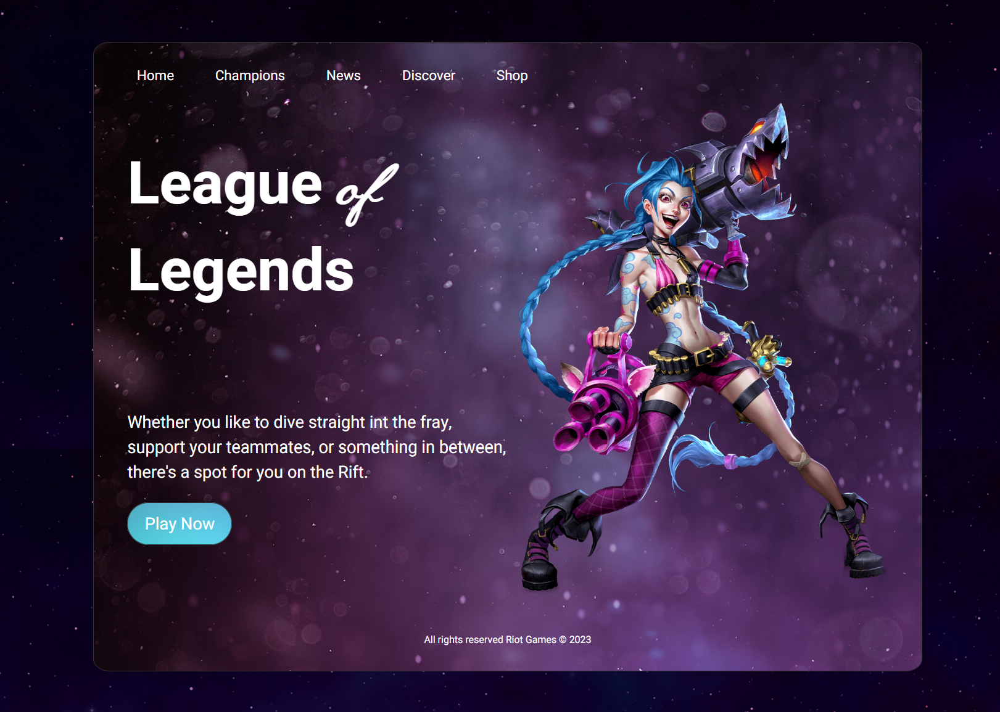

# 🎮 League of Legends Landing Page

A modern, responsive landing page for League of Legends built with HTML and CSS.



## ✨ Features

- Responsive design for all devices
- Custom typography (Heebo and MeieScript fonts)
- Interactive navigation with hover effects
- Layered background images
- Call-to-action button

## 📁 Project Structure

```
LeagueOfLegends-HTML-CSS-main/
├── index.html
├── styles/
│   └── styles.css
├── fonts/
│   ├── Heebo.ttf
│   └── MeieScript.ttf
└── images/
    ├── arcane.png
    ├── btn_bg.png
    ├── inner_bg.jpg
    └── main_bg.jpg
```

## 🚀 How to Use

1. Download or clone the project
2. Open `index.html` in your web browser
3. That's it!

## ️ Technologies

- HTML5
- CSS3
- Custom Fonts

---

**Enjoy exploring the Rift!** 🎮✨
